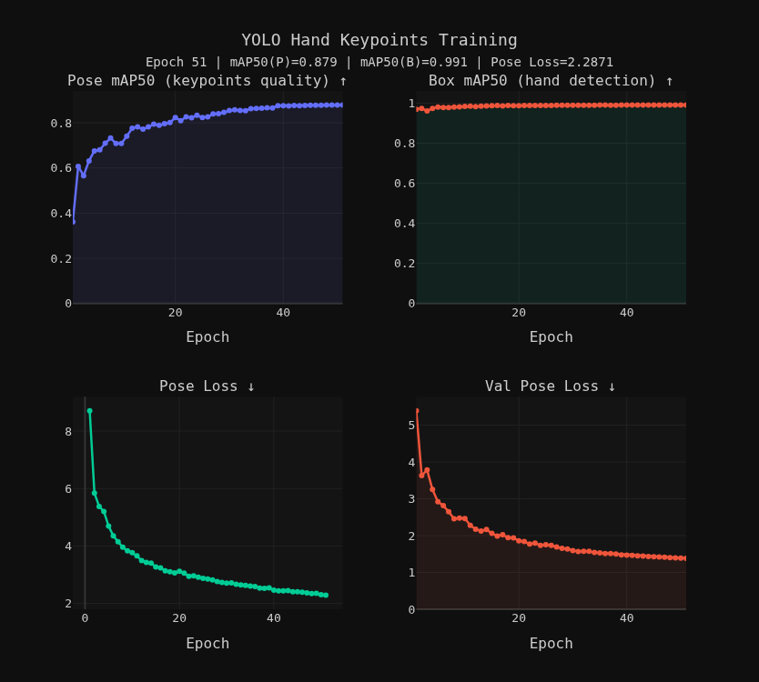

# Hand Tracker Fine-tune

Fine-tuning of **YOLOv8n-pose** on the [Ultralytics Hand Keypoints dataset](https://docs.ultralytics.com/datasets/pose/hand-keypoints/) for real-time 21-keypoint hand pose estimation.
The trained model is exported to ONNX and used by [HandSynth](https://github.com/Aresga/HandSynth) for gesture-driven audio synthesis.

---

## Quick Start

```bash
# 1. Install dependencies
pip install -r requirements.txt

# 2. Train  (downloads dataset automatically on first run)
python train.py

# 3. Export to ONNX
python export.py --weights runs/pose/hand_synth_v1/weights/best.pt
```

---

## Results



| Metric | Epoch 1 | Epoch 51 | Improvement |
|---|---|---|---|
| Pose mAP50 | 0.361 | **0.879** | +143% |
| Box mAP50 | 0.970 | **0.991** | +2.2% |
| Train Pose Loss | 8.706 | **2.287** | −73.7% |
| Val Pose Loss | 5.392 | **1.382** | −74.4% |
| Val Box Loss | 0.987 | **0.548** | −44.5% |

Box detection was already strong from epoch 1 — the base `yolov8n-pose.pt` generalises well to hands out of the box.
The major gain was in **keypoint localisation quality**: Pose mAP50 more than doubled over 51 epochs and the validation loss was still trending down.

---

## Dataset

| Property | Value |
|---|---|
| Name | [Hand Keypoints](https://docs.ultralytics.com/datasets/pose/hand-keypoints/) |
| Creator | Rion Dsilva |
| Total images | 26,768 |
| Train split | 18,776 images |
| Val split | 7,992 images |
| Keypoints per hand | 21 |
| Format | YOLO keypoint (normalised, visibility flag) |
| License | CC BY-NC-SA 4.0 |

---

## Keypoint Ordering

Standard **MediaPipe** order as used by the [Ultralytics Hand Keypoints dataset](https://docs.ultralytics.com/datasets/pose/hand-keypoints/#introduction).

| Index | Joint | Finger |
|---|---|---|
| 0 | Wrist | — |
| 1 | CMC | Thumb |
| 2 | MCP | Thumb |
| 3 | IP | Thumb |
| 4 | Tip | Thumb |
| 5 | MCP | Index |
| 6 | PIP | Index |
| 7 | DIP | Index |
| 8 | Tip | Index |
| 9 | MCP | Middle |
| 10 | PIP | Middle |
| 11 | DIP | Middle |
| 12 | Tip | Middle |
| 13 | MCP | Ring |
| 14 | PIP | Ring |
| 15 | DIP | Ring |
| 16 | Tip | Ring |
| 17 | MCP | Pinky |
| 18 | PIP | Pinky |
| 19 | DIP | Pinky |
| 20 | Tip | Pinky |

---

## Output Tensor Format

```
ONNX output shape: [1, 300, 69]

Per detection (69 values):
  [0:4]   bounding box  (cx, cy, w, h) — normalised to input size
  [4]     objectness confidence
  [5]     class index   (0 = hand)
  [6:69]  21 keypoints × 3  (x, y, confidence)
```

---

## Training

### Hardware

| Component | Spec |
|---|---|
| GPU | NVIDIA RTX 5050 (Blackwell) |
| VRAM | 8 GB |
| Training time | ~3 hours (51 epochs) |

### Key Hyperparameters

| Parameter | Value |
|---|---|
| Base model | `yolov8n-pose.pt` (pretrained) |
| Epochs | 100 (early stop at 51, patience=5) |
| Batch size | 16 |
| Image size | 640 × 640 |
| Optimizer | Auto (AdamW) |
| LR₀ / LRf | 0.01 / 0.01 |
| Pose loss weight | 12.0 |
| Box loss weight | 7.5 |
| AMP | ✅ enabled |

Full config in [`args.yaml`](args.yaml).

---

## Model Weights

Weights are distributed via **[GitHub Releases](https://github.com/Aresga/Hand-tracker-finetune/releases)**:

| File | Size | Description |
|---|---|---|
| `best.onnx` | 12 MB | ONNX export — use for inference |
| `best.pt` | 24 MB | PyTorch checkpoint (best epoch) |
| `last.pt` | 24 MB | PyTorch checkpoint (last epoch) |

---

## Repository Structure

```
├── train.py                   # Training script
├── export.py                  # ONNX export script
├── requirements.txt           # Pinned dependencies
├── args.yaml                  # Full training configuration
├── datasets/
│   └── hand-keypoints.yaml   # Dataset config
├── results/
│   ├── results.csv            # Per-epoch metrics
│   ├── training_curves.png    # Training graphs
│   ├── labels.jpg             # Dataset label visualisation
│   └── train_batch*.jpg       # Sample training batches
├── docs/
│   └── notes.txt              # Training notes and commands
└── monitor.py                 # Live training monitor
```

---

## Acknowledgements

- Dataset by **Rion Dsilva** — [Ultralytics Hand Keypoints](https://docs.ultralytics.com/datasets/pose/hand-keypoints/)
- Source images: 11k Hands, 2000 Hand Gestures, Gesture Recognition — licensed under **CC BY-NC-SA 4.0**
- Keypoint annotations generated with **Google MediaPipe**
